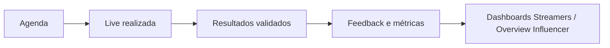

# Handoff — Apresentação Data Intelligence (Diretoria)

**Objetivo deste documento:** material de apoio para uma apresentação de **15 minutos** sobre a plataforma **Data Intelligence** (Spin Gaming), com conteúdo factual alinhado ao produto em produção. Use este handoff para:

1. **Roteiro de fala** (você)
2. **Briefing visual** (Claude ou outro designer — slides, PDF, deck)
3. **Anexo enviável** à diretoria (versão resumida no final)

**Público:** diretoria / liderança executiva (não técnica).  
**Tom:** credibilidade de dado + operação integrada; evitar jargão de engenharia (Supabase, RLS, chunks Vite).  
**Idioma do deck:** português (Brasil).

---

## 1. Mensagem central (elevator pitch — 30 s)

> **Data Intelligence** é a plataforma interna da Spin Gaming que unifica **agenda de lives**, **performance de influencers**, **conversão e financeiro**, **operação de mesas ao vivo**, **afiliados**, **marketing com rastreio UTM** e **backoffice de estúdio/RH** — com **perfis e permissões** que mostram a cada pessoa só o que precisa ver.

**Problema que resolve:** dados e processos antes espalhados (planilhas, e-mails, ferramentas isoladas).  
**Resultado para a empresa:** decisão mais rápida, menos retrabalho, rastreabilidade de campanha até GGR, e governança de quem acessa o quê.

---

## 2. Roteiro sugerido — 15 minutos

| Tempo | Bloco | O que dizer (essência) |
|-------|--------|----------------------|
| 0:00–1:30 | Abertura | Nome do produto, para quem serve (gestão, operação, parceiros), escopo “do influencer ao estúdio” |
| 1:30–5:00 | **Pilar 1 — Inteligência** | Dashboards: Streamers, Overview Spin, Overview Influencer, Mídias Sociais |
| 5:00–8:00 | **Pilar 2 — Operação de lives** | Agenda → Resultados → Feedback; cadastro Influencers; Scout |
| 8:00–10:30 | **Pilar 3 — Receita e parceiros** | Afiliados, Network, Financeiro, Banca, Campanhas, Gestão de Links |
| 10:30–12:30 | **Pilar 4 — Estúdio e pessoas** | Dealers, escala, RH, conteúdo interno (visão executiva, 1 slide cada) |
| 12:30–14:00 | **Pilar 5 — Governança** | Gestão de Usuários, operadoras, mesas, whitelabel, relatório diário à diretoria |
| 14:00–15:00 | Fechamento | Próximos passos / valor já entregue; convite a demo ao vivo ou acesso piloto |

**Dica de apresentação:** não listar as ~35 telas do menu. Agrupar em **5 pilares** (tabela acima). Detalhe por módulo fica no anexo ou “backup slides”.

---

## 3. Briefing visual para o Claude (design do deck)

### 3.1 Formato entregável

- **Deck:** 12–18 slides (corpo) + 3–5 slides backup (detalhe por seção do menu)
- **Alternativa:** PDF one-pager executivo (1 página) + deck 12 slides
- **Proporção:** 16:9
- **Export:** PPTX ou Google Slides + PDF para envio por e-mail

### 3.2 Identidade visual Spin (referência do produto)

| Elemento | Valor / nota |
|----------|----------------|
| Nome do produto | **Data Intelligence** (subtítulo opcional: *Spin Gaming*) |
| Paleta marca (Spin default) | Roxo `#4a2082` / `#7c3aed`, azul `#1e36f8`, gradiente CTAs 135° roxo→azul |
| Semântica de dados (KPIs) | Verde `#22c55e` = positivo; Vermelho `#e84025` = negativo; Amarelo `#f59e0b` = atenção; Roxo claro `#a78bfa` = bônus/FTD |
| Jogos ao vivo (fixo, não whitelabel) | Baccarat azul `#1e36f8`, Roleta vermelho `#e84025`, Blackjack verde `#22c55e`, Futebol BR amarelo `#f59e0b` |
| Tipografia | Sans moderna, legível em projeção (equivalente à UI: corpo clean + títulos em caixa alta leve) |
| Ícones | Estilo **Lucide** (linha, simples) — alinhado ao menu da plataforma |
| Evitar | Emoji no título; parecer “planilha Excel”; excesso de código ou logos de Supabase/Cloudflare |

### 3.3 Estrutura de slides recomendada

1. **Capa** — Data Intelligence + tagline  
2. **Contexto** — “Uma plataforma, todo o ciclo do influencer e da operação”  
3. **Arquitetura conceitual** (diagrama simples): Dados → Dashboards → Operação → Financeiro → Governança  
4. **Pilar 1** — Inteligência (4 bullets + mockup ou screenshot genérico de KPI)  
5. **Pilar 2** — Lives (fluxo Agenda → Resultados → Feedback)  
6. **Pilar 3** — Parceiros e receita  
7. **Pilar 4** — Estúdio, escala e RH (colagem 2×2 de ícones)  
8. **Pilar 5** — Segurança e multi-operadora (perfis + whitelabel)  
9. **Personas** — quem usa o quê (Admin, Gestor, Executivo, Operador, Agência, Influencer)  
10. **Métricas que a diretoria vê** — GGR, FTD, depósitos, ROI, lives, horas, views (ícones + definições curtas)  
11. **Automação** — Relatório diário por e-mail (agenda do dia + consolidado de ontem)  
12. **Fechamento** — Valor entregue + CTA (demo / piloto / próxima fase)  

**Slides backup (opcional):** uma slide por seção do menu (10 seções) com 3–4 bullets cada — usar só se houver perguntas.

### 3.4 Assets que o apresentador pode fornecir ao designer

- [ ] Screenshots reais (Overview Influencer, Agenda, Streamers — Overview) — **sem dados sensíveis** (blur em nomes/valores se necessário)
- [ ] Logo Spin / operadora (se whitelabel for mencionado)
- [ ] Foto ou diagrama do fluxo “live agendada → validada → métricas no dashboard”

### 3.5 Prompt sugerido para o Claude (copiar e colar)

```
Crie um deck executivo de 15 minutos (12 slides + capa + fechamento) em português
para a diretoria da Spin Gaming sobre a plataforma "Data Intelligence".

Use o handoff em docs/HANDOFF-APRESENTACAO-DIRETORIA.md (seções 1–6 e 8):
- 5 pilares, não listar 35 telas no corpo
- Paleta Spin: roxo #4a2082 / #7c3aed, azul #1e36f8, semântica verde/vermelho em KPIs
- Tom: credibilidade de dado, operação integrada, sem jargão técnico
- Incluir diagrama de fluxo Agenda → Resultados → Dashboard
- Slide de personas (Admin, Gestor, Executivo, Operador, Agência, Influencer)
- Slide do relatório diário automático para diretoria
- Notas de orador curtas por slide (30–45 s cada)
Entregue: título + bullets por slide + notas de fala + sugestão de layout/visual.
```

---

## 4. Pilares e features (conteúdo para slides e fala)

### Pilar 1 — Inteligência e dashboards

| Tela (menu) | Valor para o negócio |
|-------------|----------------------|
| **Streamers** | Visão unificada em 3 abas: **Overview** (GGR, investimento, ROI), **Conversão** (funil), **Financeiro** — filtros por mês, influencer, operadora e modo histórico |
| **Overview Spin** | Performance **financeira e operacional das mesas ao vivo** por operadora; comparativos por jogo (Baccarat, Roleta, Blackjack, Futebol BR) |
| **Overview Influencer** | Resumo executivo **por canal de influencers**: financeiro, operação e conversão |
| **Mídias Sociais** | Alcance orgânico, impulsionamento Meta e **conversão de campanhas rastreadas** |

**Frase para diretoria:** “O board vê a mesma verdade: de live a GGR, com filtros por parceiro e período.”

---

### Pilar 2 — Operação de lives

| Tela | Valor para o negócio |
|------|----------------------|
| **Agenda** | Calendário (mês/semana/dia), agendamento e acompanhamento de lives por plataforma e operadora |
| **Resultados** | Validação pós-live (após janela operacional): status, duração, views — qualidade do dado que alimenta relatórios |
| **Feedback** | Histórico validado com KPIs (lives, horas, views) por período |
| **Influencers** | Cadastro completo: perfil, canais, financeiro; visão “gestão” vs “meu perfil” conforme perfil |
| **Scout** | Funil de **prospecção** do primeiro contato ao fechamento |

**Fluxo para diagrama no slide:**



---

### Pilar 3 — Receita, parceiros e marketing

| Tela | Valor para o negócio |
|------|----------------------|
| **Afiliados** | Gestão de parceiros afiliados (perfil, financeiro, operadoras) |
| **Network** | Funil de prospecção e conversão de prospectos em afiliados |
| **Financeiro** | Ciclos de pagamento de influencers e afiliados — do rascunho ao pago |
| **Banca de Jogo** | Solicitação, aprovação e liberação de bancas por parceiro e operadora |
| **Campanhas** | Campanhas de mídia com UTMs vinculados para monitorar performance nos dashboards |
| **Gestão de Links** | Mapeamento de **UTMs detectados** a influencers, afiliados ou campanhas |

**Frase para diretoria:** “Campanha rastreada → atribuição → performance no dashboard — sem planilha paralela.”

---

### Pilar 4 — Estúdio, escala, RH e conteúdo

**Estúdio**

| Tela | Valor |
|------|--------|
| **Gestão de Dealers** | Elenco, especialidades, turnos, solicitações das operadoras |
| **Central de Notificações** | Solicitações entre operadoras e estúdio com histórico |
| **Figurinos** | Inventário, retiradas, devoluções, manutenções |
| **Roteiro de Mesa** | Scripts e orientações de live por operadora para uso em mesa |

**Escala**

| Tela | Valor |
|------|--------|
| **Gestão de Escala** | Escala por área, colaborador e dia |
| **Gestão de Staff** | Prestadores dos times de Game Floor e Operation Management |
| **Calendário** | Rotina operacional: turnos, trocas, compromissos |
| **Marketplace** | Ofertas de venda e troca de turnos |
| **Solicitações** | Solicitações em aberto e histórico por período/time |

**RH**

| Tela | Valor |
|------|--------|
| **Gestão de Prestadores** | Cadastro, head count, fluxos de RH |
| **Dados de Cadastro** | Base cadastral consolidada |
| **Organograma** | Diretorias, gerências e times |
| **Vagas** | Candidaturas e processos seletivos |
| **Central de Denúncias** | Canal de denúncias Spin |

**Conteúdo**

| Tela | Valor |
|------|--------|
| **Playbook Influencers** | Diretrizes obrigatórias + registro de ciência antes de transmitir |
| **Links e Materiais** | Link rastreado exclusivo + QR Codes para divulgação |
| **Spin na Rede** | Menções e aparições públicas da Spin na mídia |
| **Portal de RH** | Comunicados, políticas, RH Talks |
| **Informativos** | Comunicados na Home por perfil |

**Frase para diretoria (compressão):** “Do figurino ao organograma — operação física e pessoas no mesmo ecossistema digital.”

---

### Pilar 5 — Governança e plataforma

| Tela / recurso | Valor |
|----------------|--------|
| **Gestão de Usuários** | Perfis, matriz de permissões por página (Ver/Criar/Editar/Excluir), escopo de dados |
| **Gestão de Operadoras** | Parceiras, identidade visual (**whitelabel** na UI para operador) |
| **Gestão de Mesas** | Mesas disponíveis por operadora |
| **Status Técnico** | Monitoramento de integrações, alertas e sincronizações (uso mais operacional/TI — slide opcional) |
| **Relatório diário à diretoria** | E-mail automático (~manhã): **agenda do dia** + **consolidado do dia anterior** (lives, horas, views, FTDs, depósitos, GGR) |

**Perfis de acesso (slide de personas):**

| Perfil | Em uma linha |
|--------|----------------|
| Administrador | Acesso total + configuração de usuários |
| Gestor | Amplo, conforme permissões; vê todos os dados |
| Executivo | Conforme escopo de influencers/operadoras |
| Operador | Dados só do escopo atribuído (parceiro) |
| Agência | Pares influencer × operadora |
| Influencer | Próprios dados e operadoras vinculadas |

**Frase para diretoria:** “Cada parceiro vê só o seu universo; a matriz de permissões é configurável sem deploy.”

---

## 5. Glossário executivo (métricas citadas na plataforma)

Use definições curtas em um slide ou rodapé:

| Termo | Definição para diretoria |
|-------|---------------------------|
| **GGR** | Receita bruta de jogo (indicador principal de performance) |
| **FTD** | Primeiro depósito (aquisição) |
| **ROI** | Retorno sobre investimento no canal |
| **Live** | Transmissão agendada/realizada com métricas de duração e views |
| **UTM** | Parâmetros de campanha para rastrear origem do tráfego |
| **Operadora** | Casa de apostas parceira (multi-tenant na plataforma) |
| **Whitelabel** | Interface com cores/logo da operadora para perfil operador |

---

## 6. Diferenciais competitivos (talking points)

1. **Ciclo fechado:** agenda → validação → métricas → pagamento → dashboard (um sistema).
2. **Multi-operadora:** filtros, escopo e brandguide por parceiro.
3. **Segurança por desenho:** menu e dados conforme perfil + escopo (não “todo mundo vê tudo”).
4. **Semântica visual de KPI:** verde/vermelho consistente (credibilidade na reunião de números).
5. **Automação para liderança:** relatório diário por e-mail sem abrir o sistema.
6. **Rastreio de marketing:** UTMs, campanhas e gestão de links ligados a relatórios.
7. **Operação de estúdio integrada:** dealers, escala, figurinos, roteiro — além do “dashboard de influencer”.

---

## 7. O que NÃO priorizar na fala de 15 min

- Stack técnica (React, Vite, Supabase, Cloudflare) — no máximo uma linha “plataforma web moderna e segura na nuvem”.
- Detalhe de cada sub-tela de RH/Escala — mencionar existência, não demo.
- Status Técnico — só se perguntarem sobre integrações.
- Regras internas de UI (MDC, tokens CSS).

---

## 8. Anexo — Mapa completo do menu (referência)

Ordem oficial no produto:

1. **Dashboards** — Overview Spin, Streamers, Mídias Sociais, Overview Influencer  
2. **Lives** — Agenda, Resultados, Feedback, Influencers, Scout  
3. **Afiliados** — Afiliados, Network  
4. **Aquisição** — Financeiro, Banca de Jogo  
5. **Marketing** — Campanhas, Gestão de Links  
6. **Estúdio** — Gestão de Dealers, Central de Notificações, Figurinos, Roteiro de Mesa  
7. **Escala** — Gestão de Escala, Gestão de Staff, Calendário, Marketplace, Solicitações  
8. **RH** — Gestão de Prestadores, Dados de Cadastro, Organograma, Vagas, Central de Denúncias  
9. **Conteúdo** — Playbook Influencers, Links e Materiais, Spin na Rede, Portal de RH, Informativos  
10. **Plataforma** — Gestão de Usuários, Gestão de Operadoras, Gestão de Mesas, Status Técnico  

**Páginas transversais (fora do menu principal):** Home, Configurações, Ajuda (glossário e guias).

---

## 9. Checklist antes da apresentação

- [ ] Definir 3 screenshots “hero” (Streamers Overview, Agenda, Overview Influencer ou Overview Spin)
- [ ] Confirmar se menciona **relatório diário por e-mail** (já em produção se configurado no Supabase)
- [ ] Alinhar se haverá demo ao vivo (ambiente staging + usuário gestor)
- [ ] Validar com jurídico/compliance se pode mostrar nomes reais de operadoras/influencers
- [ ] Enviar PDF do deck + este anexo resumido (seção 10) por e-mail pós-reunião

---

## 10. One-pager para e-mail pós-reunião (texto pronto)

**Assunto:** Data Intelligence — resumo da plataforma Spin Gaming

A **Data Intelligence** centraliza a operação de influencers e mesas ao vivo da Spin Gaming: desde o **agendamento e validação de lives** até **dashboards executivos** (GGR, conversão, ROI), **pagamentos**, **afiliados**, **campanhas com UTM** e **backoffice de estúdio e RH**. Cada usuário acessa apenas o permitido pelo seu perfil e escopo de parceiros. A diretoria pode receber um **relatório diário automático** com a agenda do dia e o consolidado de métricas do dia anterior.

**Principais módulos:** Dashboards · Lives · Afiliados · Aquisição · Marketing · Estúdio · Escala · RH · Conteúdo · Plataforma.

Para demo ou acesso piloto, contatar: [seu nome / canal].

---

*Documento gerado a partir do menu (`src/constants/menu.ts`), subtítulos de página e documentação interna do repositório influencer-dashboard. Atualizar se o menu mudar.*
