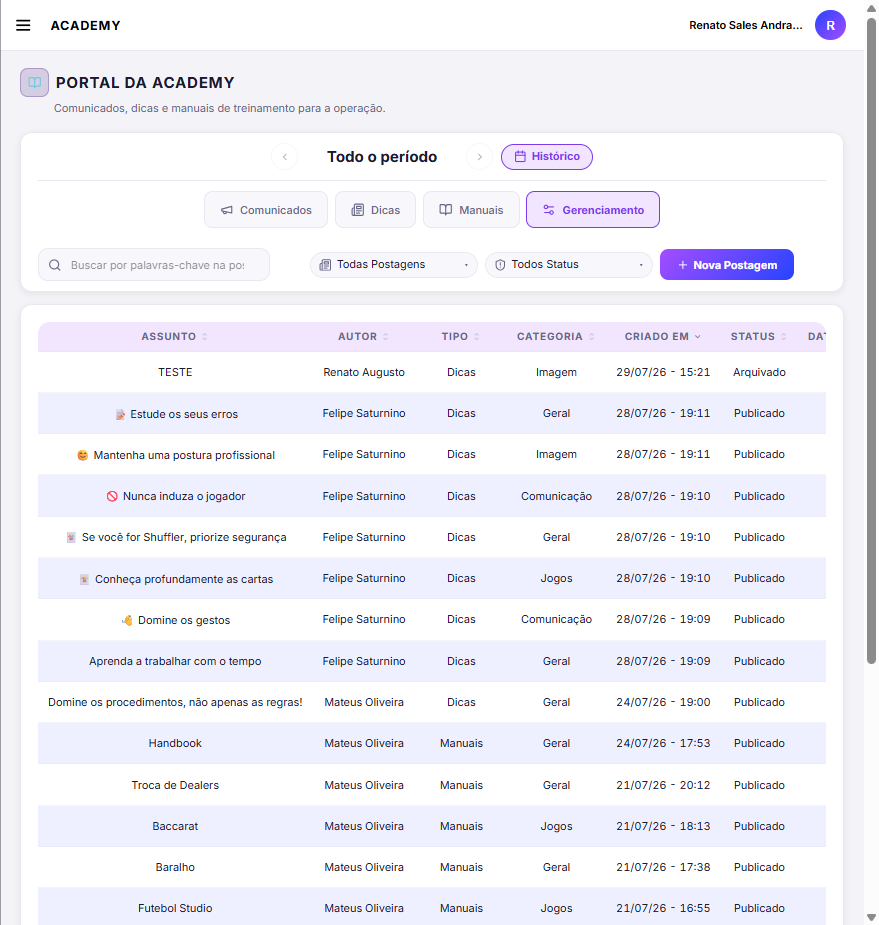
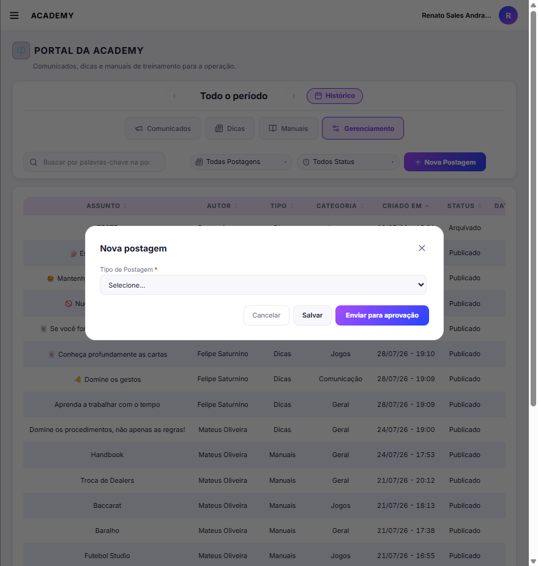
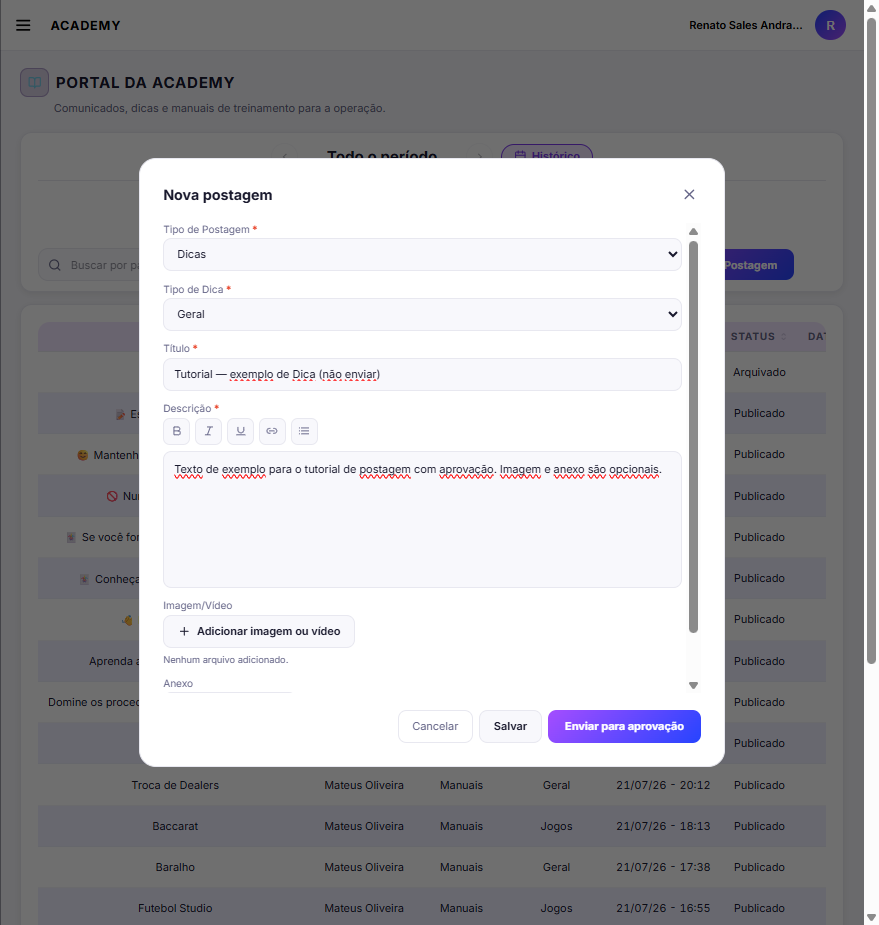

# Tutorial — Dicas Academy (Portal da Academy)

**URL:** `/Ajuda/Tutoriais/DicasAcademy`

**Perfil de referência:** usuário com Editar = **Próprios** (ex.: Service Manager) — botão **Enviar para aprovação**  
**Página:** Portal da Academy → Gerenciamento  
**Objetivo:** criar Dica ou Comunicado e enviar para aprovação (ou salvar rascunho).

Imagens em `public/tutoriais/academy/postagem-aprovacao/`.

---

## Passos

### 1. Gerenciamento → Nova Postagem

Menu **Academy** → **Portal da Academy** → aba **Gerenciamento** → **Nova Postagem**.

### 2. Tipo de postagem

Só **Comunicados** ou **Dicas**. Rodapé: **Salvar** (rascunho) e **Enviar para aprovação**.

### 3. Dica

Tipo de Dica (Jogos / Imagem / Comunicação / Geral) + Título + Descrição; mídia/anexo opcionais. Se Jogos → **Qual Jogo?**.

### 4. Comunicado

Tipo de Comunicado (Treinamentos / Geral) + Título + Descrição; mídia/anexo opcionais.

### 5. Envio

- **Salvar** → status **Rascunho**
- **Enviar para aprovação** → status **Aprovação** (ainda não aparece nas abas de leitura)
- Após aprovação por quem tem Editar = Sim → **Publicado**

---

## Notas

Capturas feitas sem enviar/salvar em produção (Cancelar após o formulário).
