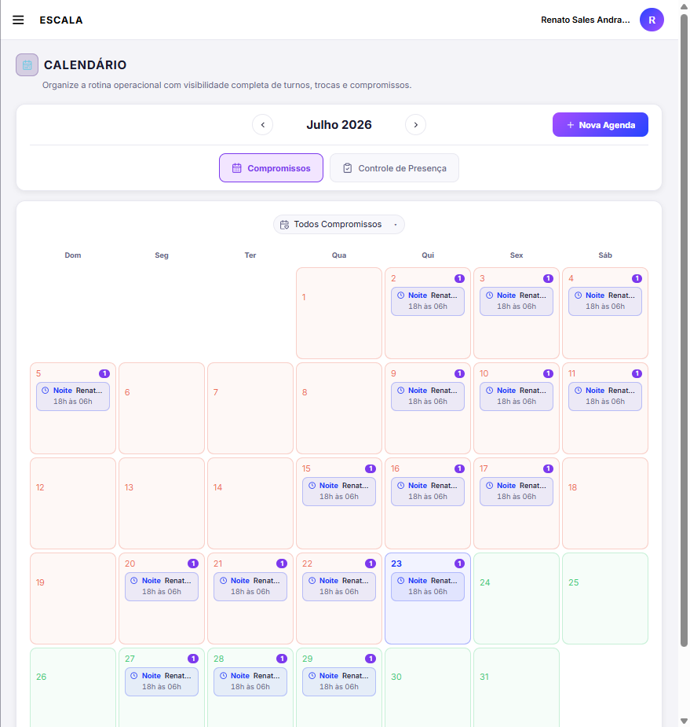
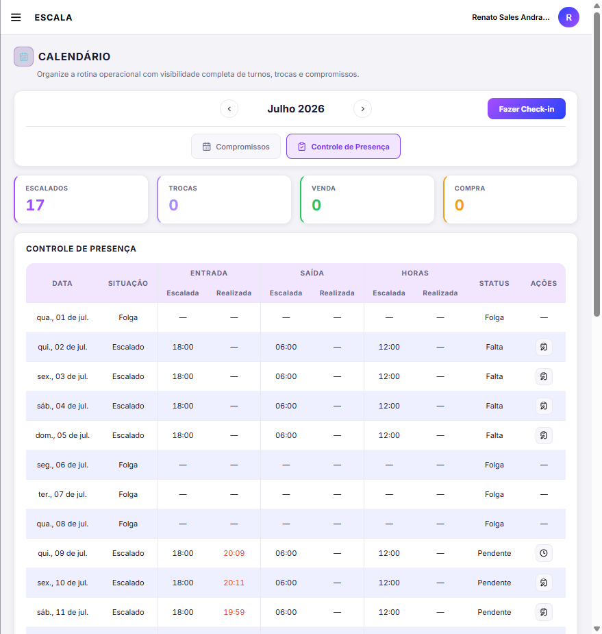
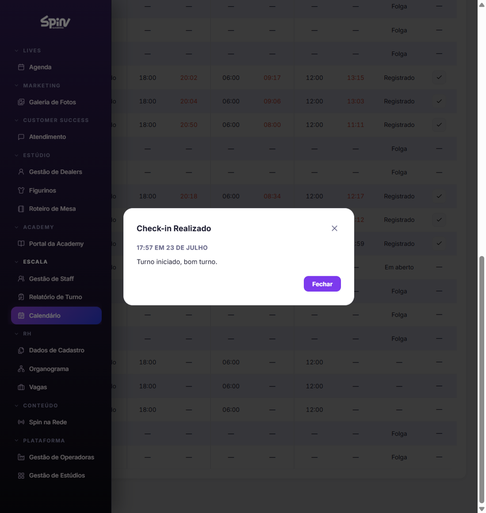
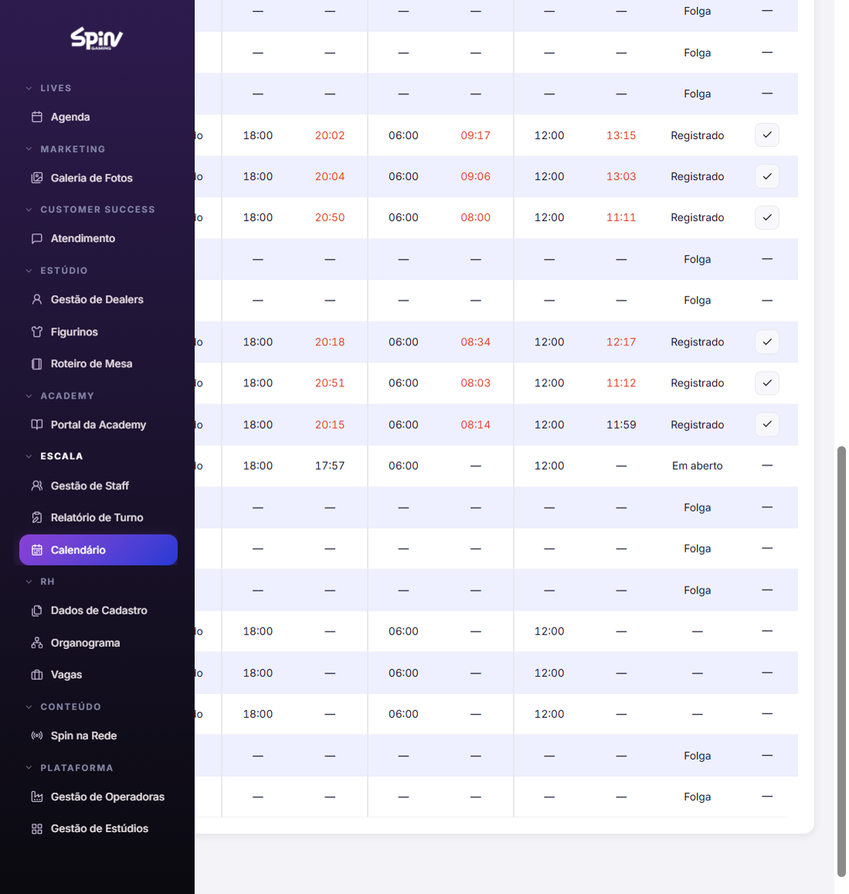
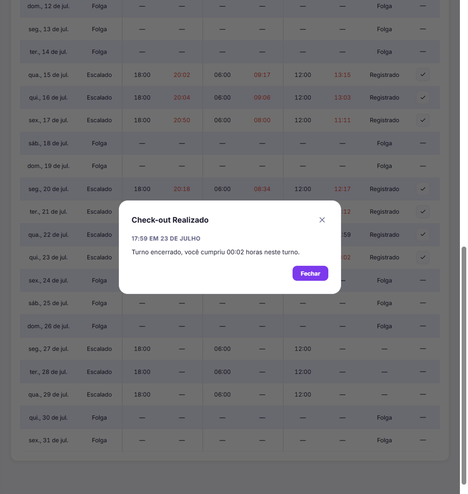
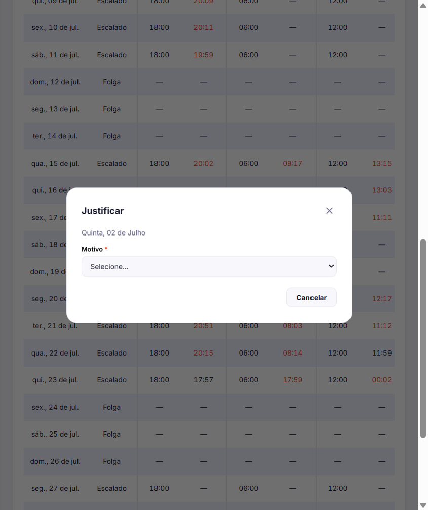
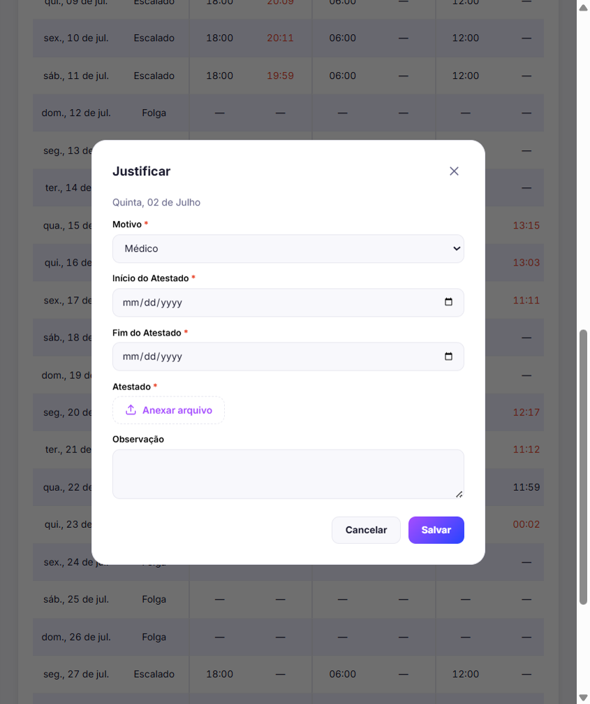
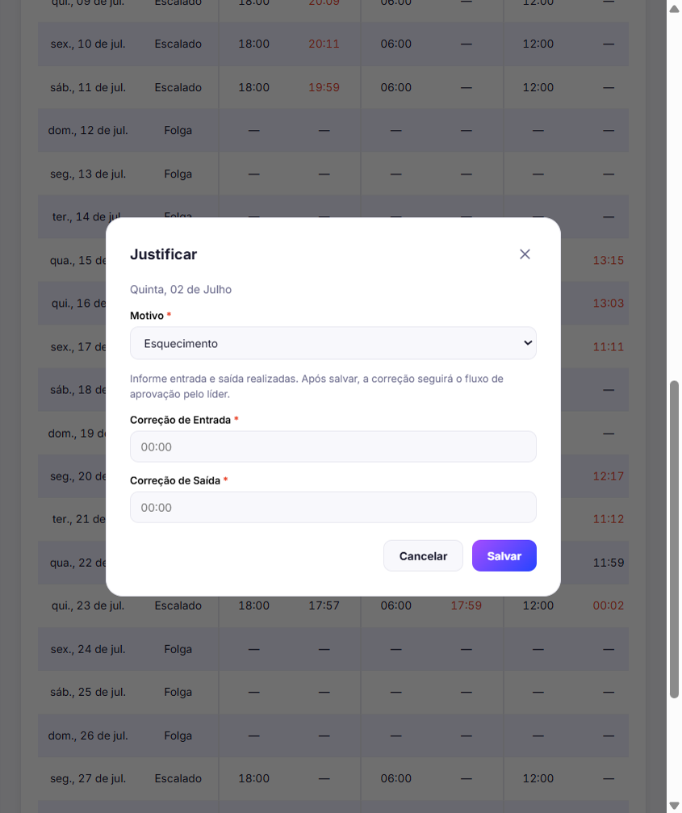
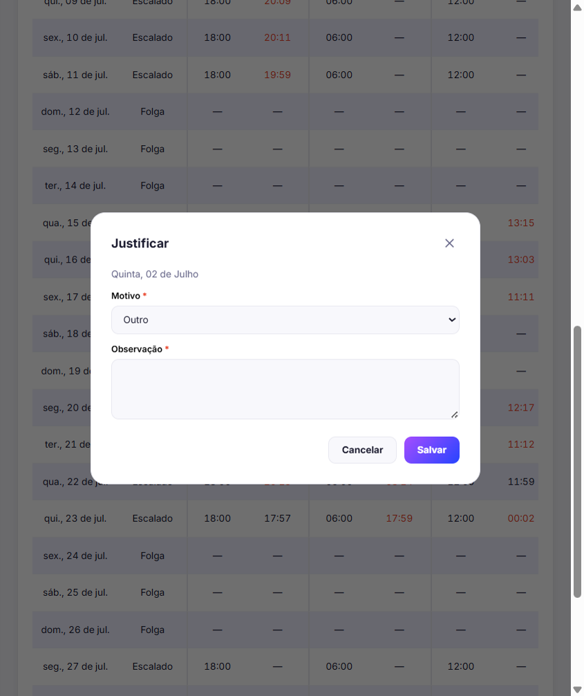

# Calendário — Prestador (visão Próprios, sem liderança)

**Público:** colaborador com permissão de **Ver = Próprios** no Calendário, que vê **apenas o próprio** calendário (sem filtros Time/Staff de equipe).

**Objetivo:** registrar ponto (Check-in / Check-out) e justificar faltas ou pendências.

**Pré-requisitos:** rede Spin (IP permitido), vínculo ativo no RH, e permissão de **Editar** no Calendário para o botão **Justificar**.

**Tempo estimado:** ~10 minutos.

**Capturas:** sessão real em Produção (jul/2026), conta de exemplo Prestador — turnos **Noite**.

---

## 1. Abrir o Calendário

1. No menu, seção **Escala**, clique em **Calendário**.
2. A aba padrão é **Compromissos**: grade do mês com turnos publicados (ex.: Noite 18h–06h).
3. Quem tem só visão própria **não** vê filtros de Time/Staff nem “Meu Controle”.

---

## 2. Ir para Controle de Presença

1. Clique na aba **Controle de Presença**.
2. Veja o resumo (Escalados, Trocas, Venda, Compra) e a tabela do mês:
   - **Situação:** Escalado ou Folga
   - **Entrada / Saída:** Escalada vs Realizada (horário realizado em vermelho quando diverge)
   - **Status:** Folga, Falta, Pendente, Registrado, Em aberto, etc.
   - **Ações:** ícone de **Justificar** quando o dia permite

---

## 3. Check-in

1. Com o mês **atual** selecionado, use o botão **Fazer Check-in** (canto direito da barra).
2. Confirme o modal **Check-in Realizado** (horário e mensagem “Turno iniciado, bom turno.”).
3. Clique em **Fechar**.

4. Após o check-in:
   - O botão passa a **Fazer Check-out**.
   - Na linha do turno, o status fica **Em aberto** e a **Entrada realizada** é preenchida.

**Observações**

- O ponto **não** depende de estar Escalado no dia (coberturas / plantão); a Situação pode continuar Folga.
- Se aparecer aviso de rede, conecte-se à rede Spin e tente de novo.

---

## 4. Check-out

1. Ao encerrar o turno, clique em **Fazer Check-out**.
2. Confirme o modal **Check-out Realizado** (horário + horas cumpridas no turno).
3. Clique em **Fechar**.
4. O status da linha tende a **Registrado** (ou Pendente, conforme regras do dia). O botão volta a **Fazer Check-in** (pode ficar desabilitado por um tempo se o fluxo do dia já estiver fechado).

---

## 5. Justificar (Falta ou Pendente)

Use quando o status for **Falta** ou **Pendente** (após o limite) e existir o ícone **Justificar** na coluna Ações.

1. Clique em **Justificar** na linha do dia.
2. Confira a data no título do modal (ex.: “Quinta, 02 de Julho”).
3. Em **Motivo**, escolha uma opção:

### 5.1 Modal inicial

### 5.2 Motivo Médico

Campos: início e fim do atestado, anexo do atestado, observação opcional.  
Ao salvar, o RH recebe uma solicitação de **Atestado** em **Solicitações** (status Em análise).

### 5.3 Motivo Esquecimento

Informe **Correção de Entrada** e **Correção de Saída** (formato HH:MM).  
Após salvar, a correção segue para **aprovação do líder**.

### 5.4 Motivo Outro

**Observação** obrigatória descrevendo o caso.

4. Clique em **Salvar** (ou **Cancelar** para sair sem registrar).
5. Depois de salvar com sucesso, o botão **Justificar** some naquela linha.

**Neste material de captura:** os três motivos foram abertos só para demonstração; **não** foi salvo justificativa em Produção.

---

## 6. O que este perfil normalmente não faz

| Ação | Quem faz |
|------|----------|
| Aprovar presença da **equipe** / **Aprovar Presença** do mês | Líder (Material 2) |
| Analisar correção no tooltip do líder | Líder (Material 2) |
| Relatório de Presença de outros | Depende de Editar; fora do foco deste guia |

Em alguns dias **Registrado**, pode aparecer ícone de **Aprovação de Turno** no próprio calendário — o fluxo de aprovação de **equipe** está no Material 2 (líder).

---

## Checklist rápido

- [ ] Menu → Calendário → **Controle de Presença**
- [ ] **Fazer Check-in** no início do turno (rede Spin)
- [ ] **Fazer Check-out** ao encerrar
- [ ] Dias **Falta** / **Pendente**: **Justificar** com o motivo correto
- [ ] Médico: lembrar que o RH atende em **Solicitações**

---

## Imagens desta pasta

| Arquivo | Conteúdo |
|---------|----------|
| `01-calendario-compromissos.png` | Aba Compromissos |
| `02-controle-presenca.png` | Aba Controle de Presença |
| `03-cta-check-in.png` | Botão Fazer Check-in |
| `04-modal-check-in-realizado.png` | Confirmação de Check-in |
| `05-apos-check-in-tabela.png` | Tabela com Em aberto |
| `06-modal-check-out-realizado.png` | Confirmação de Check-out |
| `07-modal-justificar.png` | Justificar (motivo vazio) |
| `08-justificar-medico.png` | Motivo Médico |
| `09-justificar-esquecimento.png` | Motivo Esquecimento |
| `10-justificar-outro.png` | Motivo Outro |
