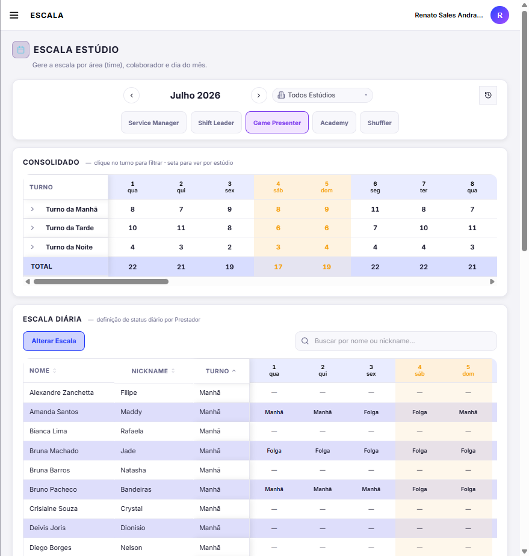
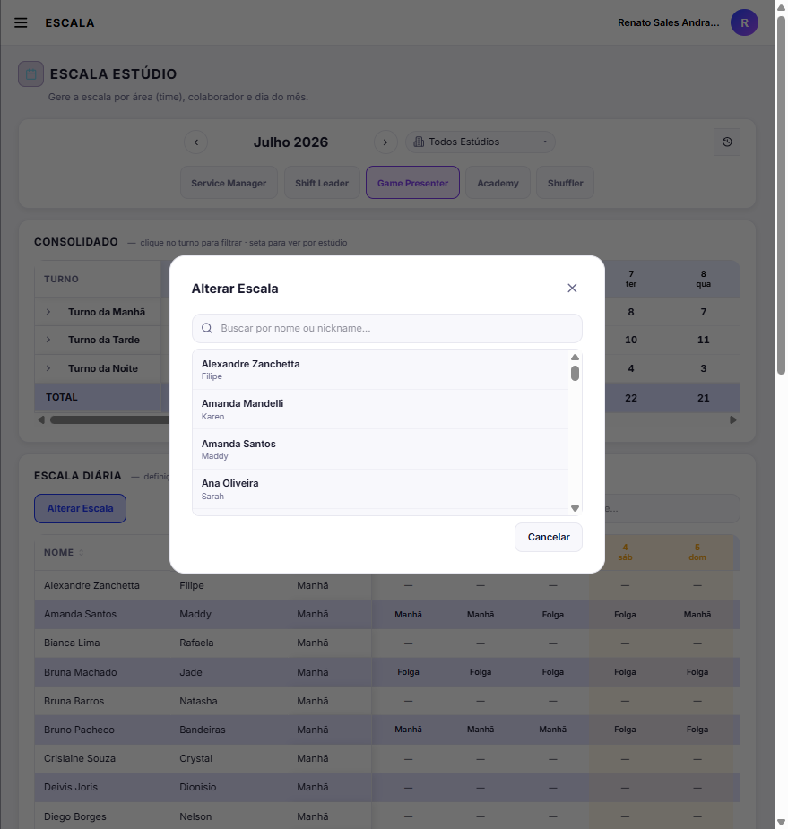
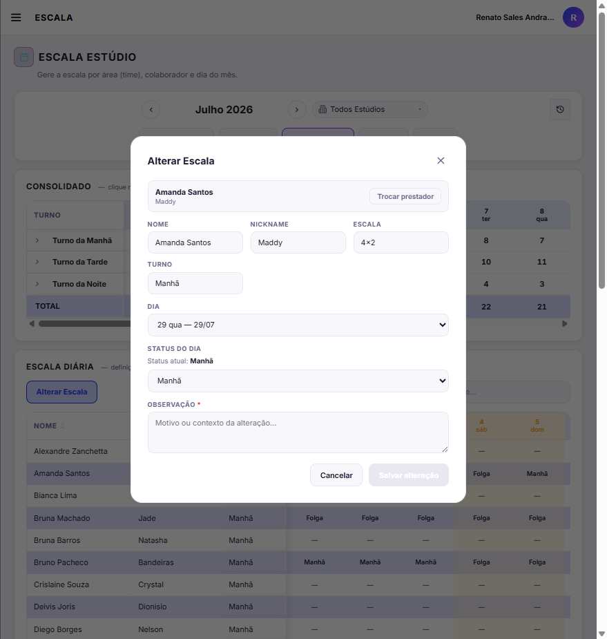
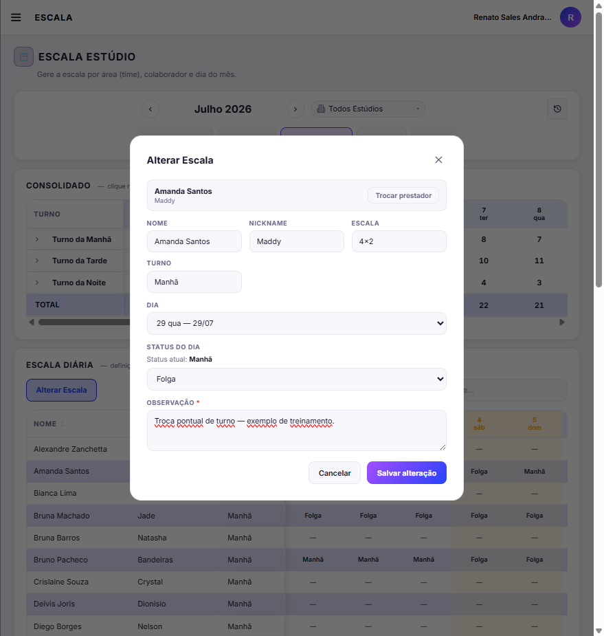

# Tutorial — Alterar Escala (Escala Estúdio)

**Perfil de referência:** Service Manager (mesmo acesso de Editar que Shift Leader)  
**Página:** Escala Estúdio (`/EscalaEstudio`)  
**Objetivo:** alterar o status de **um dia pontual** de **outro** prestador do Estúdio, com a escala do mês já **aprovada**.

Imagens também em `public/tutoriais/escala/alterar-escala/` (aba Ajuda → Tutoriais).

---

## Pré-requisitos

- Escala do mês **aprovada** (botão **Alterar Escala** visível).
- Permissão de **Editar** em Escala Estúdio.
- Rede / ambiente com acesso à plataforma.

---

## Passos

### 1. Abrir a Escala Estúdio

1. Menu **Escala** → **Escala Estúdio**.
2. Escolha o mês no carrossel.
3. Aba da área (ex.: **Game Presenter**).
4. Clique em **Alterar Escala** (azul, toolbar da Escala Diária).

### 2. Buscar o prestador

1. No modal, busque por nome ou nickname.
2. Clique na linha do prestador.
3. **Trocar prestador** volta à lista.

### 3. Dia

1. Confira Nome, Nickname, Escala e Turno (somente leitura).
2. Em **Dia**, escolha uma data **≥ hoje**.
3. Veja o **Status atual** do dia.

### 4. Status + observação → Salvar

1. **Status do dia:** Folga · Manhã / Tarde / Noite · Compra / Venda / Troca.
2. **Observação** obrigatória (motivo claro).
3. **Salvar alteração** — ou **Cancelar** para sair sem gravar.

### 5. Conferência

- Célula na Escala Diária com o novo status + ícone de comentário (hover: autor, anterior, observação).
- Histórico de ações do mês (ícone na barra de filtros) inclui a linha **Alterar Escala**.

---

## Notas

- Só para **ajuste pontual** em escala aprovada — não substitui montagem de rascunho.
- A alteração reflete no **Calendário** do prestador.
- Capturas feitas sem gravar alteração real em produção (Cancelar após o formulário completo).
